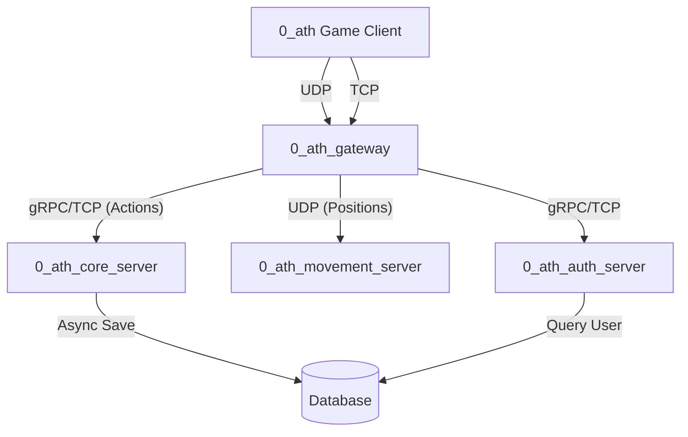

# 0_ath Core Network Flow

The following diagram illustrates the fundamental data pipeline for the `0_ath` MMO, specifically highlighting how the Gateway proxies TCP and UDP traffic to our internal microservices.

## 1. Login Flow (TCP)
1. The Game Client establishes a TCP connection to the `0_ath_gateway`.
2. The Client sends an XOR-encrypted `CLAskLogin` packet containing the user's credentials.
3. The Gateway decrypts the packet and forwards the credentials to the `0_ath_auth_server` via an internal request.
4. The Auth Server queries the Database, verifies the credentials, and responds to the Gateway with the Player's identity ("This is Player 1").
5. The Gateway maps the `net.Conn` to the specific Player Account and returns an `LCRetLogin` success packet to the Client.

## 2. Movement Flow (UDP)
1. The Client holds 'W' to move their character.
2. The Client spams UDP position coordinate packets (marshalled via Protobuf) to the `0_ath_gateway` (Port `8081`).
3. The Gateway's UDP Proxy listener continuously receives these packets and immediately relays them to the `0_ath_movement_server` (Port `9000`).
4. The Movement Server updates its internal Area of Interest (AoI) grid and broadcasts the new coordinates back to all nearby players.
