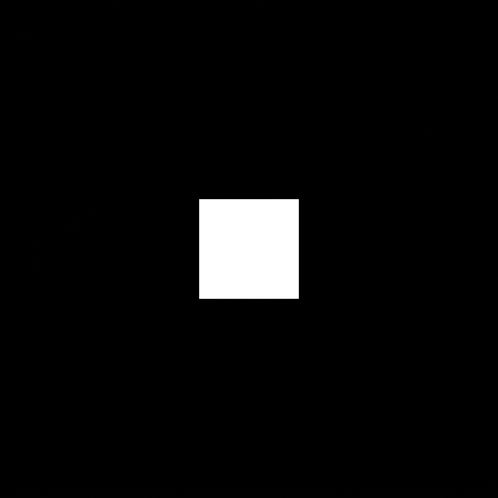

# Game Assets and Mechanics

This page tracks the current 1:1 visual assets, parsing mechanics, and entity interactions currently implemented in the `0_ath` codebase.

## Character Preset
Our `Player` entity (`0_ath_client/data/player.go`) is currently represented by a minimalist geometric shape to strictly test client-server movement mechanics without being distracted by sprite art.

### Player Mechanics
- **Base Attributes**: Players spawn with a `Radius` of 12.0 and a base `Color` of pure blue (`R: 0, G: 0, B: 255`).
- **Movement**: Standard WASD movement mapped to a `Vector2` struct, normalized to prevent diagonal speed boosting. Base `MovementSpeed` is 5.
- **Dash Mechanic**: Triggered via `Spacebar`. A successful dash sets `DashIntensity` to 1.0, multiplying movement speed by 25.0 to create a surge forward. Dash intensity decays by 0.05 per tick.
- **Visual Effects (SmokeTime)**: The client tracks `SmokeTime`, which increments every tick the player is moving or dashing, serving as the basis for particle effect rendering.
- **Basic Skills**: Pressing `1` currently triggers a basic skill that instantly changes the player's color to yellow (`R: 255, G: 255, B: 0`).

## Zone & Collision Logic
Zones (`0_ath_client/data/zone.go`) are the foundational layer for world interaction.
- **Environment**: Zones have a default Gray background. We construct test arenas (Labyrinths) using `Rectangle` structs representing "Neon Walls".
- **Collision Checking**: The `IsWalkable` function performs a hybrid check:
  1. **AABB vs Circle**: Simple mathematical bounds checking against the `Walls` array.
  2. **Image-Based Collision**: If a `CollisionMap` (PNG/JPEG) is loaded, it checks the underlying grid cell (8.0 pixel scale). Pure black pixels (`R: 0, G: 0, B: 0`) are treated as walkable.

## Asset Parsers
We use a custom binary format for terrain generation parsed by the `0_ath_assets` micro-module.

### Heightmap Parser (`0_ath_assets/parser/heightmap.go`)
- **Format**: Custom `.mhef` binary format identified by the `MHEF` magic header.
- **Structure**: Stores version, width, height, and a linear array of `float32` depth/height data. 
- **Usage**: This is translated by the zone server to apply topological depth to the normally flat 2D collision grids.

## Entity Skills
Currently, entity skills are being prototyped in `0_ath_client/data/skill.go`.
- **Structure**: Skills track `CooldownDuration`, `Radius`, `RangePixel`, `AoeRangePixel`, and `KeyBinding`.
- **Current Prototype**: The active skill prototype is `Teleport()`, which fires when its assigned key binding is triggered.
