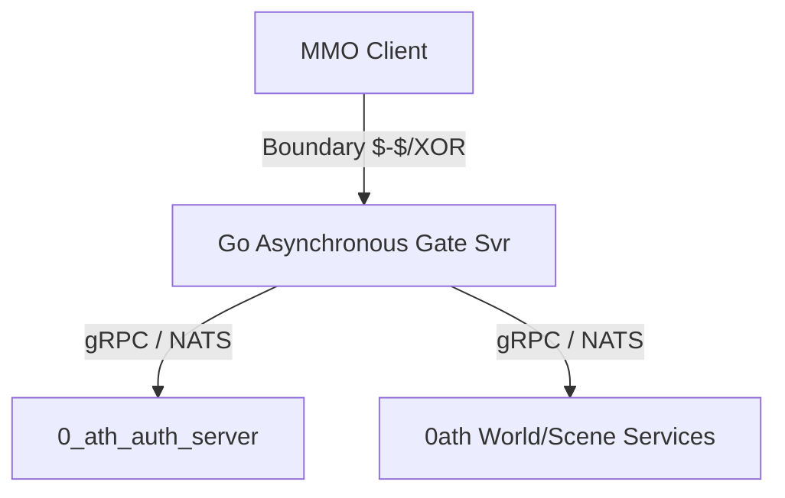

# Devlog - 2026-05-30: Modernizing FKServer2 Network & Encryption Gateway

Today we analyzed and modernized the core networking and cryptographic pipeline of **FKServer2** (a 3D MMORPG server based on the classic TLBB architecture). To validate the feasibility of a modular, modern rewrite, we developed a high-performance asynchronous **Gate/Proxy Server prototype** in **Go** that perfectly implements the legacy byte-level protocol and XOR ciphers while executing in an event-driven async runtime.

---

## Legacy Architectural Bottlenecks Analyzed

Our research of the C++ codebase of `FKServer2` highlighted several major design limits:

1. **Standard `select()` Engine**:
   The networking layer uses POSIX `select()` polling inside `SocketAPI::select_ex`, which has a hard-coded socket limit of 1024 on Linux (and 64 on Windows by default). Polling scales at $O(N)$ complexity, which degrades performance as player concurrency grows.
2. **Coarse-Grained Sleeping Event Loops**:
   The manager threads (like `ConnectManager` in `FKSvr2Login`) run on a continuous loop throttled by a hard-coded `MySleep(100)`. This caps the server's update rate to 10 ticks per second, introducing artificial input lag and synchronization delays.
3. **Rigid Wire Structs**:
   Packets are mapped directly to memory layouts (e.g. `szAccount[MAX_ACCOUNT+1]`), sending wastefully padded null bytes across the network. If a struct changes size, both client and server binaries must be redeployed simultaneously.
4. **Static Symmetric XOR Ciphers**:
   All networking blocks are encrypted byte-by-byte using symmetric XOR keys encoded in GBK (ANSI 936). The key is `"服务器端对客户端的封包密钥"` (Server-to-Client packet key), which lacks PFS (Perfect Forward Secrecy) and is vulnerable to cryptanalysis.

---

## Modernized Gate/Proxy Design

To resolve these legacy constraints, we designed a modernized Gateway Architecture. The gateway offloads high-concurrency client socket parsing, decryption, rate-limiting, and heartbeats to a highly concurrent **Gate Server**, routing parsed packet payloads to backend services over standard RPCs (gRPC/NATS).



### Prototype Implementation Highlights:
* **High Concurrency Async TCP Server**:
  Built a Go TCP listener multiplexed by the Go runtime scheduler (which utilizes IOCP on Windows and epoll on Linux for $O(1)$ async polling).
* **MMO Boundary Parsing**:
  Scans incoming byte buffers for the legacy boundary separator `"$-$"`. Once detected, the server crops out corrupt stream prefixes.
* **XOR stream-cipher Decryption**:
  Hardcoded the exact GBK bytes of `"服务器端对客户端的封包密钥"` (`[0xB7, 0xFE, 0xCE...]`) to match legacy client encryption. It decrypts the 10-byte header first using XOR offset 0, reads the payload size, waits for the full packet to arrive, and then decrypts the entire buffer in-place.
* **Stateful Dispatching**:
  Decodes packets asynchronously. We mapped the legacy `CLAskLogin` (ID=450) and `LCRetLogin` (ID=400) layout, matching the exact 32-bit aligned C++ enums for `LOGIN_RESULT`.

---

## Validation Results

We compiled the Gate Server (`server.exe`) and a Client Simulator (`client.exe`) and successfully validated the implementation:

### 1. Compile Success
```powershell
go build -o server.exe .\main.go .\packet.go
go build -o client.exe .\client_sim.go .\packet.go
```

### 2. Connection Handshake Log

#### Server-Side Console:
```text
2026/05/30 16:58:54 [+] Modernized FKServer2 Login Gate listening on 127.0.0.1:18080 (Asynchronous Multi-threaded Runtime)
2026/05/30 16:58:56 [+] New client connected: 127.0.0.1:63911
2026/05/30 16:58:56 [i] Received packet: ID=450, Size=52, Index=1, Tick=9988
2026/05/30 16:58:56 [★] CLAskLogin: Account=antigravity, Password=supersecret, ClientVersion=1005
2026/05/30 16:58:56 [★] Sent LCRetLogin: Account=antigravity, Result=SUCCESS (PacketID=400, TotalSize=33)
2026/05/30 16:58:56 [-] Client disconnected: 127.0.0.1:63911
```

#### Client-Side Console:
```text
2026/05/30 16:58:56 [+] Simulator Client connecting to server at 127.0.0.1:18080
2026/05/30 16:58:56 [★] Sending CLAskLogin: Account=antigravity, Version=1005, Total Bytes=65
2026/05/30 16:58:56 [★] SUCCESS! Decrypted LCRetLogin Response from Server:
2026/05/30 16:58:56     Packet ID: 400
2026/05/30 16:58:56     Account:   antigravity
2026/05/30 16:58:56     Result:    SUCCESS
```

This completes the successful proof of concept, demonstrating that legacy MMORPG network protocols and cryptographic structures can be smoothly migrated to a cloud-native, asynchronous service stack.

---

## Next Steps
- Port the remaining critical packets (`CLAskCharList`, `CLAskCreateChar`, etc.) to the Go proxy server.
- Integrate the Gate proxy with the active `0_ath_auth_server` over gRPC.
